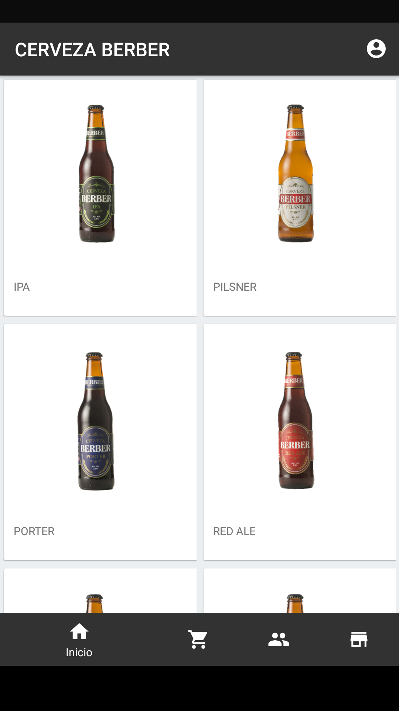
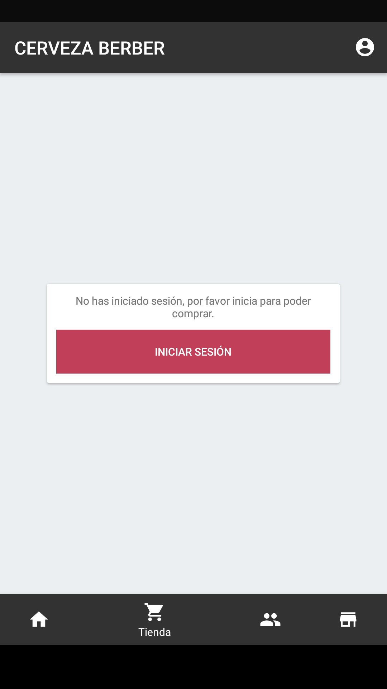
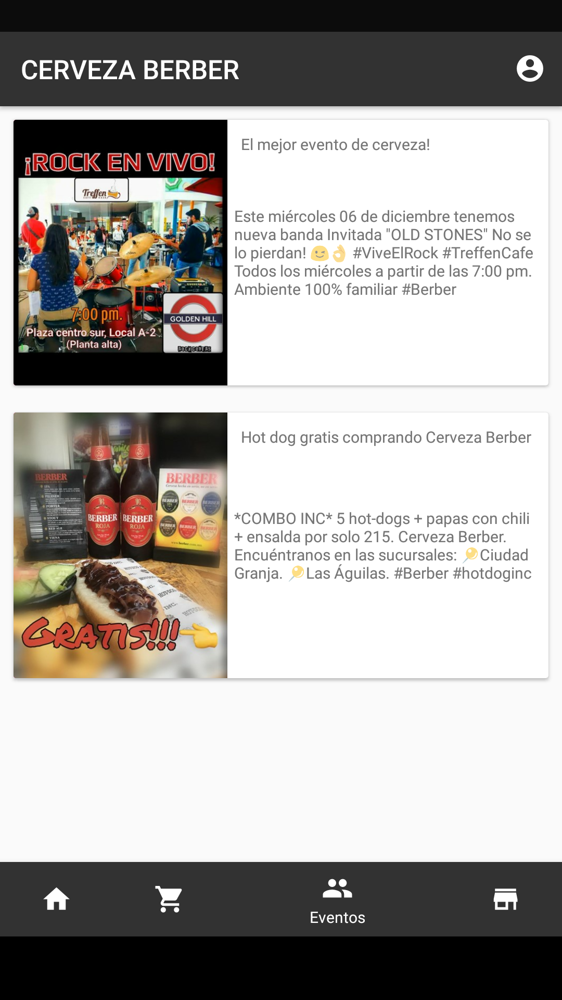
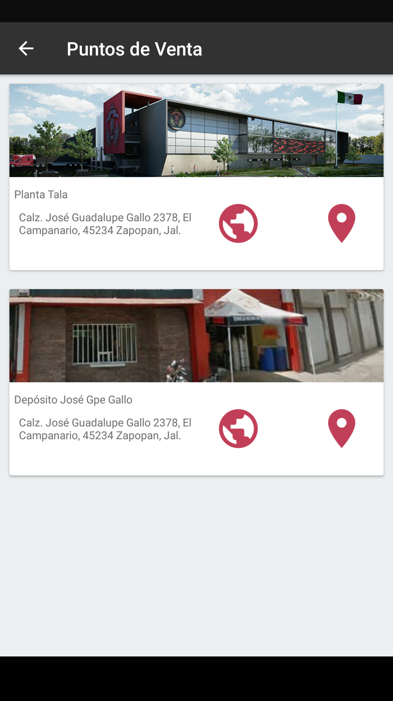
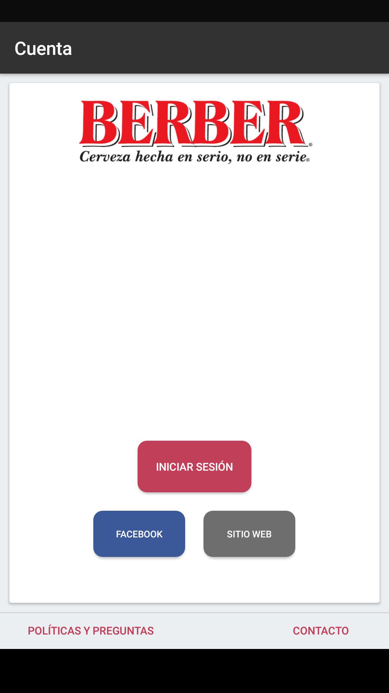
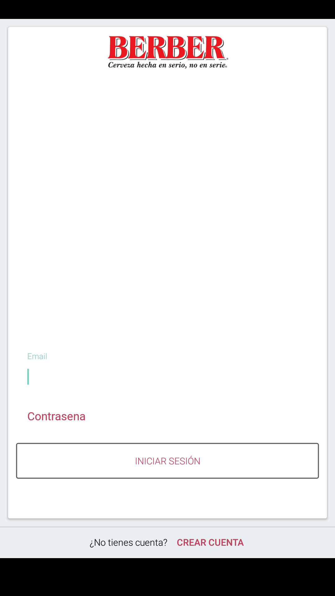
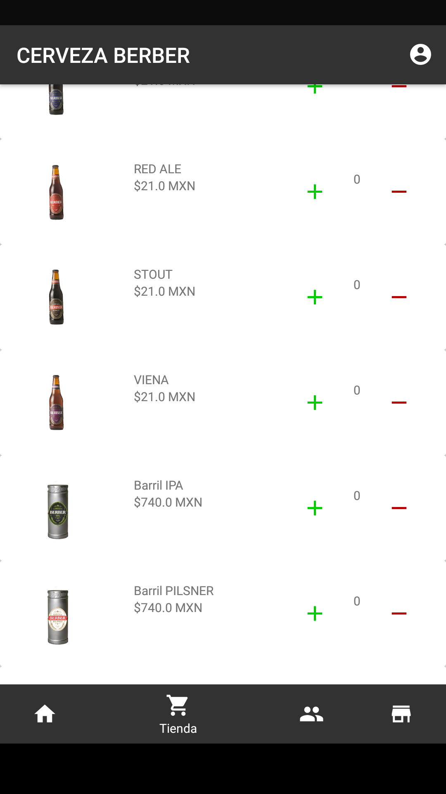
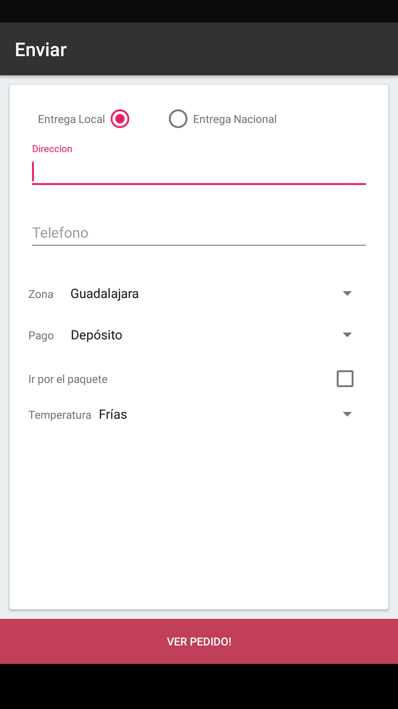
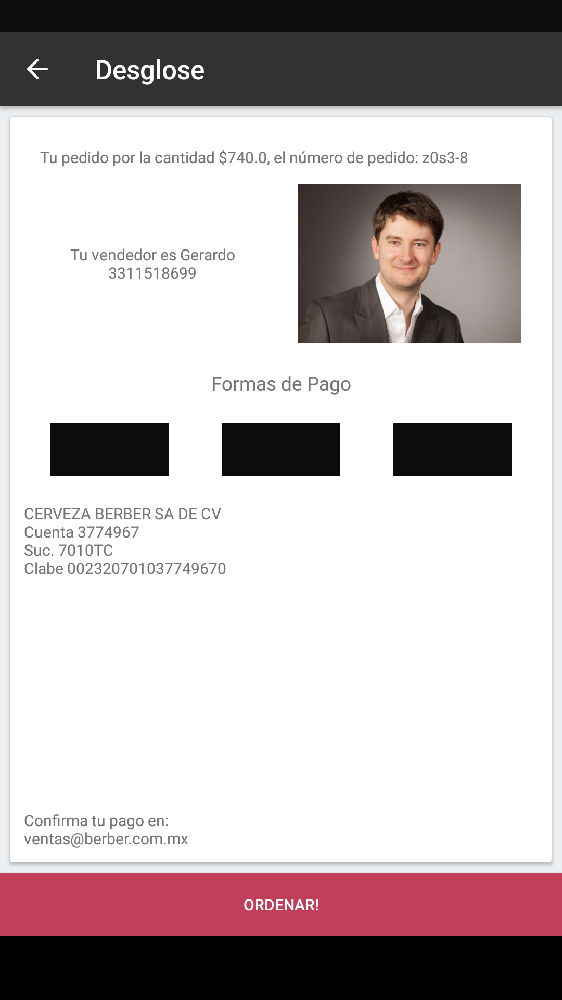

Berber App For Android
==

This app is for a beer company that wants to show its beers, also their upcoming events and be able to buy beers.

The app is not yet complete, also currently working on iOS version.

Below are some images of the app itself:

 

 

 

 

 

